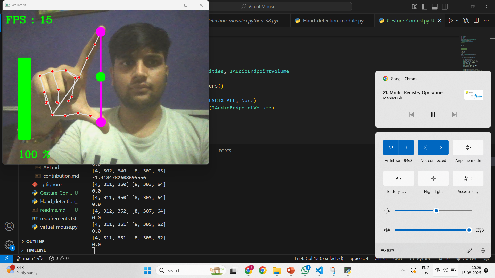
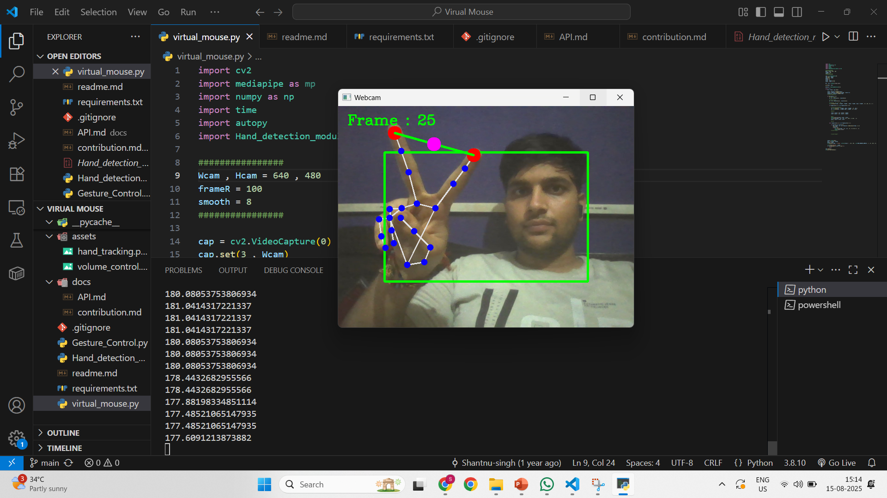
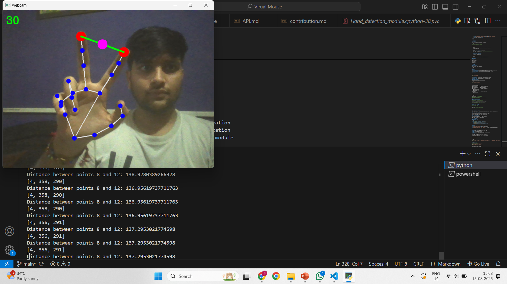

# 🎯 Gesture Control System

[](https://python.org)
[](https://opencv.org)
[](https://mediapipe.dev)
[](LICENSE)
[](CONTRIBUTING.md)

> **A sophisticated computer vision-based gesture control system that enables hands-free interaction with your computer through real-time hand tracking and gesture recognition.**


## 🌟 Features

### 🖱️ Virtual Mouse
- **Cursor movement** using index finger tracking
- **Click functionality** with thumb-index finger pinch gesture
- **Smooth cursor movement** with built-in stabilization
- **Boundary detection** with customizable frame regions

### ⚡ Advanced Hand Detection
- **Multi-hand support** with configurable detection confidence
- **21-point hand landmark detection** using MediaPipe
- **Real-time finger counting** and gesture recognition
- **Optimized performance** with configurable FPS display

## 📸 Screenshots

<table>
  <tr>
    <td align="center">
      
      <br/>
      <sub><b>Volume Control Interface</b></sub>
    </td>
    <td align="center">
      
      <br/>
      <sub><b>Virtual Mouse Control</b></sub>
    </td>
  </tr>
  <tr>
    <td align="center">
      
      <br/>
      <sub><b>Hand Landmark Detection</b></sub>
    </td>
    <td align="center">
      
      <br/>
      <sub><b>Gesture Recognition</b></sub>
    </td>
  </tr>
</table>

## 🚀 Quick Start

### Prerequisites

Ensure you have Python 3.8+ installed on your system.

```bash
python --version
# Should return Python 3.8.x or higher
```

### Installation

1. **Clone the repository**
   ```bash
   git clone https://github.com/Shantnu-singh/Virual-Mouse.git
   cd gesture-control-system
   ```

2. **Create a virtual environment** (Recommended)
   ```bash
   python -m venv gesture_env
   source gesture_env/bin/activate  # On Windows: gesture_env\Scripts\activate
   ```

3. **Install required dependencies**
   ```bash
   pip install -r requirements.txt
   ```

4. **Verify camera access**
   ```bash
   python -c "import cv2; print('OpenCV installed successfully')"
   ```


## 💻 Usage

### Volume Control

Launch the volume control application:

```bash
python "virtual_mouse.py"
```

**Gestures:**
- 📏 **Distance Control**: Move thumb and index finger closer/apart to decrease/increase volume
- 🔴 **Minimum Volume**: Circle turns red when fingers are too close (< 50px)
- 🟢 **Maximum Volume**: Circle turns green when fingers are far apart (> 280px)
- 📊 **Visual Feedback**: Real-time volume bar and percentage display

### Virtual Mouse

Launch the virtual mouse application:

```bash
python Gesture_Control.py
```

**Gestures:**
- 👆 **Move Cursor**: Raise index finger only to control cursor movement
- 🤏 **Click**: Bring index and middle fingers together (< 45px distance)
- 🟩 **Active Zone**: Green rectangle shows the active tracking area

### Hand Detection Module

Use the standalone hand detection for development:

```bash
python Hand_detection_module.py
```

## 🏗️ Project Structure

```
gesture-control-system/
├── 📄 Gesture Control .py      # Volume control application
├── 🖱️ virtual_mouse.py          # Virtual mouse application  
├── 🤲 Hand_detection_module.py  # Core hand detection module
├── 📋 requirements.txt         # Project dependencies
├── 📖 README.md               # Project documentation
├── 📁 assets/                 # Screenshots and demo files
│   ├── demo.gif
│   ├── volume_control.png
│   ├── virtual_mouse.png
│   └── hand_tracking.png
└── 📁 docs/                   # Additional documentation
    ├── API.md
    └── CONTRIBUTING.md
```

## 🔧 Configuration

### Camera Settings
```python
# Adjust camera resolution in main files
wCam, hCam = 720, 620  # Width, Height

# Modify detection confidence
detector = hdm.HandDetection(min_detection_confidence=0.6)
```

### Volume Control Customization
```python
# Adjust distance range for volume control
finalVol = np.interp(distance, [50, 280], [vMin, vMax])

# Modify volume bar position and size
cv2.rectangle(frame, (50, 150), (85, 400), (0, 255, 0), 3)
```

### Mouse Control Settings
```python
# Modify tracking area
frameR = 100  # Frame reduction

# Adjust smoothing factor
smooth = 8    # Higher = smoother movement
```

## 🎯 How It Works

### 1. Hand Detection Pipeline
```
Camera Input → MediaPipe Processing → Landmark Detection → Gesture Recognition → Action Execution
```

### 2. Virtual Mouse Logic
- Tracks index finger position for cursor movement
- Implements smoothing algorithm for stable cursor control
- Detects pinch gesture for click functionality
- Maps camera coordinates to screen coordinates

## 🛠️ API Reference

### HandDetection Class

```python
class HandDetection:
    def __init__(self, min_detection_confidence=0.5)
    def findHand(self, frame, flag=True)
    def findPosition(self, frame, handno=0, draw=True)
    def findDistance(self, frame, point1, point2, draw=True)
    def handUp(self, frame)
```

#### Methods

- **`findHand(frame, flag=True)`**: Detects hands in the frame
- **`findPosition(frame, handno=0, draw=True)`**: Returns 21 hand landmarks
- **`findDistance(frame, point1, point2, draw=True)`**: Calculates distance between two landmarks
- **`handUp(frame)`**: Returns finger up/down status as binary list

## 🚦 Performance Optimization

### System Requirements
- **OS**: Windows 10/11, macOS 10.14+, Linux Ubuntu 18.04+
- **Python**: 3.8 or higher
- **RAM**: Minimum 4GB, Recommended 8GB
- **Camera**: Any USB webcam or built-in camera
- **CPU**: Multi-core processor recommended for real-time processing

### Performance Tips
- Ensure good lighting conditions for better hand detection
- Position camera at eye level for optimal tracking
- Close unnecessary applications to free up system resources
- Use a USB 3.0 camera for better frame rates

## 🐛 Troubleshooting

### Common Issues

**Camera not detected:**
```bash
# Test camera access
python -c "import cv2; cap = cv2.VideoCapture(0); print('Camera OK' if cap.read()[0] else 'Camera Error')"
```

**Import errors:**
```bash
# Reinstall dependencies
pip uninstall opencv-python mediapipe
pip install opencv-python mediapipe
```

**Volume control not working (Windows):**
- Ensure audio service is running
- Check if pycaw has proper permissions
- Try running as administrator

**Performance issues:**
- Lower camera resolution in code
- Reduce detection confidence threshold
- Close other applications using camera

## 🤝 Contributing

We welcome contributions! Please see our [Contributing Guidelines](CONTRIBUTING.md) for details.

### Development Setup

1. Fork the repository
2. Create a feature branch: `git checkout -b feature/amazing-feature`
3. Make your changes and test thoroughly
4. Commit your changes: `git commit -m 'Add amazing feature'`
5. Push to the branch: `git push origin feature/amazing-feature`
6. Open a Pull Request

### Code Style
- Follow PEP 8 guidelines
- Add docstrings to all functions
- Include type hints where appropriate
- Write unit tests for new features


## 📄 License

This project is licensed under the MIT License - see the [LICENSE](LICENSE) file for details.

## 🏆 Acknowledgments

- **MediaPipe Team** - For the excellent hand tracking solution
- **OpenCV Community** - For computer vision tools
- **pycaw Developers** - For Windows audio control
- **autopy Team** - For cross-platform automation

## 📞 Support

- 📧 **Email**: singhshatnu2001@gmail.com
- 🐛 **Issues**: [GitHub Issues](https://github.com/Shantnu-singh/Virual-Mouse/issues)
- 📖 **Documentation**: [Full Documentation](https://github.com/Shantnu-singh/Virual-Mouse/blob/main/docs/API.md)

---

<div align="center">
  <p><strong>Made with ❤️ for the open source community</strong></p>
  <p>If this project helped you, please consider giving it a ⭐!</p>
</div>
